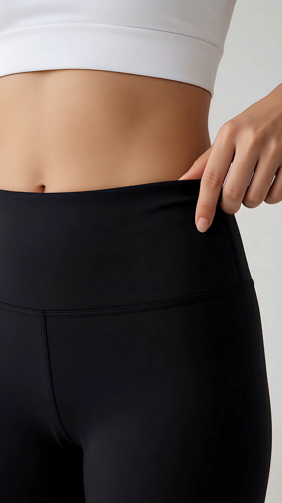

# LITTO 最终输出质量检核

检核日期：2026-10-06。结论：**现有样片返修，不通过可信真人成片验收，更不能标注已达好莱坞电影级质感。新版产品的实际出片效果仍未验证。**

后续实施：用户要求继续升级后，已修复空复核覆盖告警、一键自动标完所有检查项的问题，加入独立的最终文件检测与人工五项验收、版本失效检查；视频辅助抽样上限提高到 48 帧。详见 [质量升级记录](qualityUpgrade.md)。以下产品能力表保留审计当时状态；旧样片本身没有被修好，不能因系统升级改判通过。

这不是按清晰度给电影打分。当前已经发现直接破坏人体可信度的缺陷；其余镜头再漂亮也不能抵消。当前版本没有被修改、重生成或重新混音，本报告不代表返修已完成。

## 对象、证据与覆盖范围

- 对象：`data/tenants/01M41BFE9CRC8HEQENRBE2F09E/workspaces/lululemon瑜伽裤/assets/成片_人物统一_v1.mp4`，与项目内《交付说明（成片版）》对应。
- SHA-256：`e8cf88e69b87927071ddd509fa5c66aba300195bb5fbf53f16ad5cff223f9b23`。
- 实测 33.875 秒，720×1280，H.264、8-bit 4:2:0；AAC 双声道、32 kHz。812 个视频帧，全文件解码未报错。没有把 720p 单独当成审美不合格的原因。
- 读取项目镜头表、视频提示词、字幕与交付说明；按每秒 4 帧检查全片时间范围的连续抽样，并查看选定原尺寸帧；核对第 1 镜和第 5 镜原始生成文件。
- 五个主切点实测为 4.458、9.625、16.208、23.500、28.708 秒。
- 全片音频做响度、真峰值、静音区间、接点前后能量检测。**本次没有实际试听，也没有完整逐帧播放；声音情绪、对白完整性、口型、短暂动作伪影不能据此通过。**
- 这是改造前已有样片，不能把发现的问题或局部优点当成新版生成链路的 A/B 结果。一个广告样片也不能证明全部题材的输出能力。

原始日志与文件指纹见 [证据目录](outputQualityEvidence/reviewManifest.json)。[全片概览](outputQualityEvidence/overview.jpg)用于定位，不用于判断微纹理。

## 五项检核

| 维度 | 结论 | 实际证据及边界 | 优先级与最小返修 |
| --- | --- | --- | --- |
| 皮肤与材质 | 返修 | 25 秒原尺寸近景中，腹部呈大面积均匀平滑明暗，黑色裤料有缝线但面内纤维/织物响应不足，尚不能支撑镜头表要求的“面料纹理清晰”。768×1344 原始镜头在约 1.5 秒也存在同类表现，不能只归咎于最终缩放。不是要求远景强行看见毛孔，也不能凭画面确认真实 Nulu 材质。 | 高：更换第 5 镜源素材；用真实商品近摄参考锁住织物、缝线、腰头与受力形变。保持适合该景别的皮肤细节，禁止用锐化、脏污或噪点冒充。 |
| 人物动作 | **不通过，阻断交付** | 2.5 秒原尺寸帧同时出现向上伸出的手臂、向画面左下伸出的另一条袖臂及右侧弯曲手臂，即三臂。第 1 镜原始生成文件同一时间亦如此。连续抽样显示额外手臂并非只发生在切镜边界。 | 最高：淘汰这段动作。换取经完整播放检查的候选；不能靠叠化、调色或局部静帧修补来宣称视频动作已修复。未证实有足够长的干净区间前，不直接裁短凑时长。 |
| 场景光线 | 局部可接受，整体未通过 | 卧室左侧窗光与衣柜侧光有可见来源，公园与草地有夕阳依据，未见证据支持把所有光线都判假。但 23.5 秒从暖色户外切到白底中性棚拍、28.708 秒又回夕阳，缺少统一的段落组织。能解释为商品插入镜，不能解释为连续同场景。没有连续播放证据证明全片无闪烁。 | 中：先确认插入镜用途，再匹配人物肤色、黑裤暗部和反差；避免所有空间套同一暖色滤镜。保持窗光、夕阳、棚拍各自物理来源。 |
| 镜头连续性 | **返修** | 公园黑色上装 → 白色上装面料特写 → 黑色上装背影，服装状态没有交代；咖啡店赤脚与出门通勤叙事不协调；多镜裤脚接近小腿中段，与“高腰九分”产品锁定描述存在差距。第 3 镜实际为已坐下喝咖啡，不包含镜头表的入店动作。 | 高：先统一真实商品轮廓与场景服装卡。第 5 镜可换为不露上装且商品一致的近景，或明确设为另一段商品展示。咖啡店补真实鞋履或修改情境，不能仅添转场掩盖。 |
| 声音接缝 | 技术异常需返修；听感未验证 | 23.517–24.792 秒低于 −50 dBFS，覆盖面料镜开头约 1.28 秒；16.208–16.571 秒也有低电平空隙。28.708 秒前后各半秒单声道 RMS 从 −53.2 到 −12.6 dBFS，相差 40.6 dB，是强烈的复听信号，不等同于已测得 40.6 LU 的主观响度跳变。 | 高：在分轨中核对声音来源、必要的环境底、音乐进入和动作声；先处理片段电平，再按具体声源做声桥/淡化。保持有意静默，不能无条件填满所有静音。必须实际试听复查。 |

### 核心证据

**第 1 镜，成片 2.5 秒：额外手臂。**

[同时间原始生成帧](outputQualityEvidence/sourceArm.png)也有缺陷，返修责任在源视频生成和采用验收，不在最终编码。

**第 5 镜，成片 25 秒：皮肤与裤料材质。**

[原始素材近景](outputQualityEvidence/sourceMaterial.png)用于排除“只因成片降分辨率才变平”的单一解释。这里是基于可见图像的材质表现判断，不是对真实产品成分的鉴定。

动作抽样见 [0–6 秒](outputQualityEvidence/motion01.jpg)、[6–12 秒](outputQualityEvidence/motion02.jpg)、[12–18 秒](outputQualityEvidence/motion03.jpg)、[18–24 秒](outputQualityEvidence/motion04.jpg)、[24–30 秒](outputQualityEvidence/motion05.jpg)、[30 秒至结束](outputQualityEvidence/motion06.jpg)。每页从左至右、从上至下，约 0.25 秒间隔；尾页空格为拼版补位，不是成片黑帧。

## 声音与交付实测

全片综合响度 −13.5 LUFS，真峰值 −1.4 dBFS，响度范围 LRA 26.6 LU。短片的 LRA 受低电平段和声音进入影响，不能单独据此定罪；综合响度看似正常也不能抵消局部接点问题。以下 RMS 为解码后 48 kHz 单声道、接点两侧各 0.5 秒的均方根电平，不是 LUFS。

| 接点/秒 | 前半秒 dBFS | 后半秒 dBFS | 应检查的内容 |
| --- | ---: | ---: | --- |
| 4.458 | −59.8 | −48.3 | 卧室到衣柜的低电平间隔是否有意 |
| 9.625 | −54.5 | −46.7 | 咖啡店空间声是否自然建立 |
| 16.208 | −42.3 | −60.9 | 户外镜开始的声音空隙 |
| 23.500 | −54.5 | −63.2 | 商品特写开头持续低电平 |
| 28.708 | −53.2 | −12.6 | 强声音进入是否突兀、遮蔽其他声音 |

[响度与静音日志](outputQualityEvidence/audioStats.txt)保留 FFmpeg 检测证据。视频和音频轨时长差约 8 毫秒，没有明显的轨总时长错配；这不证明口型或动作声同步。

另有两项交付差距：

1. 镜头表为 30 秒，实际多出 3.875 秒。交付说明建议从镜 1 裁约 4 秒，但镜 1 总长仅约 4.46 秒，不能不顾动作与叙事照搬此建议。
2. 当前 MP4 只有音视频轨，没有嵌入字幕轨；外部 SRT 存在。33.8 秒仍是背影画面，未见镜头表要求的最终品牌落版。品牌文字只在外部字幕文件中不等于成片已有落版。

## 对产品验收能力的检核

新版有真实参考裁图、原尺寸区域抽样、真人规格、采用检查、剪点候选、声音组接与接缝预览，这些是修复和审看的工具，不是自动质量保证。

| 检查入口 | 当前能力 | 仍不能证明什么 |
| --- | --- | --- |
| `cloud/src/domain/qc-vision.ts` | 每个视频取 8 个全帧样本，可追加中部/尾部局部区域；明确声明抽样边界。 | 短暂手物穿透、完整动作受力、口型和声音连续，仍可能漏检。 |
| `cloud/src/domain/qc.ts`、`realism.ts` | 人工维度确认、严重缺陷门禁、媒体与规格指纹。 | 检查项被勾选不等于确实完整播放；五项中没有独立的最终混音/接缝听审状态。 |
| `cloud/src/domain/cutEditing.ts` | 接点附近外观和局部帧变化量候选，以及真实渲染预览。 | 外观相似不能判断台词是否切断、人物情绪是否承接，更不会修复三臂。 |
| `cloud/src/domain/nle-render.ts` | 可渲染、混音、做整体响度归一化，成功保存标 `SUCCEEDED`。 | 该状态仅代表导出成功；没有证明最终导出文件已通过这五项内容检核。全局响度处理不能代替局部混音。 |

本地 `data/cloud/litto.db` 的 renders 表没有该成片的导出记录；样片可从工作区文件与交付说明定位。因此没有证据说明它经过新版时间线和新版验收，不能声称本次已完成新版端到端效果验收。

本次只做用户要求的检核与证据留档，没有把未知项改成通过，没有更改项目采用记录、原片或配置，也没有调用付费模型。

## 返修与复查顺序

1. **先修人体硬伤**：更换第 1 镜；完整播放候选，并逐帧复核伸臂、回落与遮挡阶段。多肢、肢体增减、明显穿透任何一项存在即不得交付。
2. **锁产品与人物状态**：统一裤长、腰头、缝线、标志和各段服装；更换第 5 镜近景。皮肤只保留真实可见细节，不人为增加毛孔、皱纹或改变人物身份。
3. **重建五个接点的声画关系**：先保留动作收势与入镜动作，再决定硬切还是其他转场；音乐与环境声按段落安排，重点复听 23.5 和 28.708 秒。重拍/重混后需要重新测量，不能沿用本报告数值。
4. **匹配光色并检查导出**：在原素材精度内调整肤色、黑裤暗部与场景反差，不用统一滤镜替代光源逻辑；按实际平台目标交付，不把放大分辨率当成新增真实细节。
5. **最终文件验收**：按正常速度完整看听一次；逐一复查人体接触、镜面关系、每个切点前后至少 1 秒、对白/字幕和片尾。再用实际导出文件查一次，保留文件哈希和问题时间码。任何核心维度仍未验证，则整片保持待验收。

“电影级”在这里是用户要求的质量目标，不使用虚构认证或无依据的百分制。达到目标至少应做到：没有破坏可信度的硬伤，材质适合景别和光线，动作与声音有因果，场景与人物状态连贯，并且以上证据来自最终文件。**当前样片尚未达到这一基础，更不具备承诺超预期的证据。**
